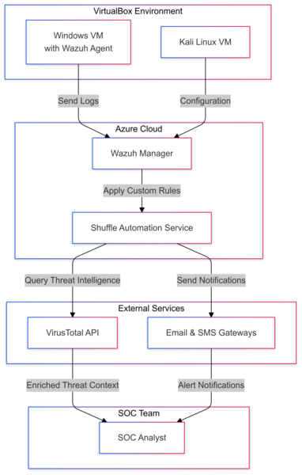

## SOC Automation  
Automating Security Operations with Wazuh, Shuffle, and Azure for real-time threat detection and response.

---

## Key Features  
- 🌟 **Tech Stack**: Wazuh + Shuffle + Azure  
- 🛡️ **Centralized Threat Monitoring** with Wazuh agents.  
- 🤖 **Automated Incident Response** using Shuffle workflows.  
- 📈 **Enriched Alerts** with Cyber Threat Intelligence (CTI).  
- ⚡ **Real-Time Notifications** for critical events.  
- 🌐 **Scalable Deployment** with Azure Cloud.  

---

## Architecture Overview  
The system architecture demonstrates the integration of Wazuh, Shuffle, and VirusTotal for automating SOC processes.  



---

## **Workflow Diagram**  
The workflow illustrates the end-to-end process, from log generation to notification delivery.  


---

### **1. Prerequisites**  
Make sure you have the following tools and platforms ready:  
- **VirtualBox**: To manage virtual machines.  
- **Kali Linux VM**: For testing and monitoring.  
- **Windows VM**: To install the Wazuh Agent.  
- **Azure Cloud VM**: To deploy the Wazuh Manager.  
- **Shuffle Automation Service**: For workflow automation.  
- **VirusTotal API Key**: For threat intelligence integration.  

---

### **2. Environment Setup**  

#### **2.1. Set Up Wazuh Manager on Azure**  
1. **Create an Azure VM**:  
   - Recommended specs: Ubuntu 20.04 LTS, 2 CPUs, 4 GB RAM, and 50 GB storage.  
2. **Install Wazuh Manager**:  
   - Follow the official guide for the [Wazuh Manager Installation](https://documentation.wazuh.com/current/installation-guide/index.html).  
3. **Configure Security Groups**:  
   - Open ports **1514** (TCP/UDP) and **1515** (TCP) for the Wazuh Agent to communicate with the Manager.  

#### **2.2. Set Up Wazuh Agent on Windows VM**  
1. Download and install the Wazuh Agent on the Windows VM:  
   - Use the [Wazuh Agent Installation Guide](https://documentation.wazuh.com/current/installation-guide/wazuh-agent/wazuh-agent.html).  
2. Configure the Wazuh Agent to send logs to your Wazuh Manager:  
   - Edit the `ossec.conf` file to include your Wazuh Manager’s IP address:  
     ```xml
     <server>
       <address>[WAZUH_MANAGER_IP]</address>
       <port>1514</port>
     </server>
     ```
   - Restart the Wazuh Agent service to apply the changes:  
     ```cmd
     net stop wazuh-agent
     net start wazuh-agent
     ```

#### **2.3. Verify Log Forwarding**  
1. Access the Wazuh Dashboard on the Azure VM via a web browser.  
2. Navigate to **Agents -> Logs** and confirm that logs from the Windows VM are being received.

---

### **3. Integrate Shuffle Automation**  

#### **3.1. Set Up Shuffle**  
1. Sign up for Shuffle: [Shuffle Signup](https://shuffler.io/).  
2. Create a new workflow in Shuffle for log classification and automation.  

#### **3.2. Connect Wazuh to Shuffle**  
1. Configure Wazuh to forward specific logs to Shuffle based on custom rules:  
   - Edit `ossec.conf` to route logs matching specific conditions:  
     ```xml
     <output>
       <command>
         <name>shuffle_integration</name>
         <program>/path/to/shuffle_script.sh</program>
       </command>
     </output>
     ```
   - Restart the Wazuh service on the Manager:  
     ```bash
     sudo systemctl restart wazuh-manager
     ```

#### **3.3. Add Threat Intelligence**  
1. Obtain your VirusTotal API Key by signing up on [VirusTotal](https://www.virustotal.com/).  
2. Configure the Shuffle workflow to query VirusTotal for threat intelligence:  
   - Add a step in your workflow to use the VirusTotal API for analyzing suspicious indicators.  

---

### **4. Email and SMS Notifications**  

#### **4.1. Configure Notifications**  
1. In Shuffle, add email and SMS notification services to your workflow.  
2. Specify conditions for sending notifications based on log classifications.

---

### **5. Final Testing**  
1. Trigger a sample event on the Windows VM to generate logs.  
2. Verify the end-to-end flow:  
   - Logs are sent to the Wazuh Manager.  
   - Logs matching custom rules are routed to Shuffle.  
   - Notifications are sent via email and SMS.

---

## Future Scope  
The SOC Automation framework can be further enhanced with:  
- **AI/ML Integration**: Implementing machine learning models to predict and mitigate threats in real time.  
- **Advanced Analytics**: Creating dashboards for better visualization of threat patterns and incident responses.  
- **Multi-Cloud Support**: Extending deployment to hybrid and multi-cloud environments.  
- **Improved Notification Mechanisms**: Adding support for in-app notifications or integration with platforms like Slack and Teams.  
- **Behavioral Analysis**: Introducing anomaly detection to identify insider threats and unknown patterns.

---

## Conclusion  
The **SOC Automation** project successfully demonstrates the power of integrating tools like **Wazuh**, **Shuffle**, and **VirusTotal** to automate and streamline SOC processes. Key accomplishments include:  
- Centralized log collection and monitoring with Wazuh.  
- Automated workflows with Shuffle to classify and enrich logs.  
- Real-time notifications through email and SMS for critical incidents.  

This project addresses the challenges faced by traditional SOCs, such as alert fatigue and delayed responses, and sets the foundation for scalable, proactive threat management in modern cybersecurity environments.

---

> **Note**: For a clearer understanding of the implementation, refer to the [Images Repository](./images/) where detailed visuals are provided.

---
<style>
  body {
    font-family: 'Poppins', sans-serif;
  }
</style>
